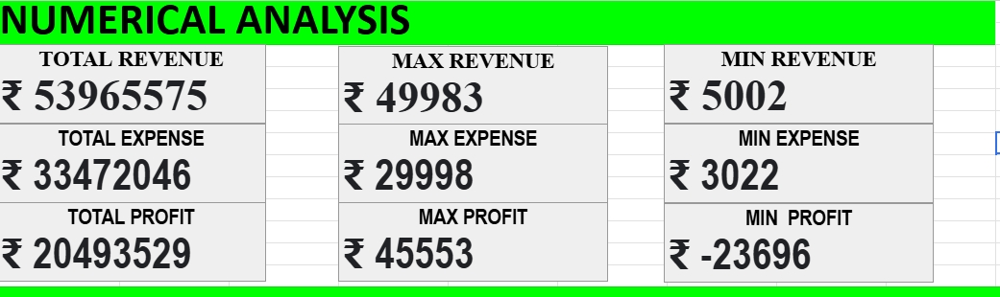
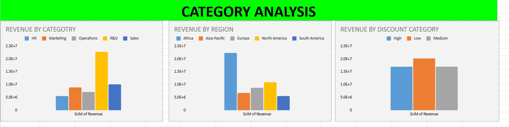
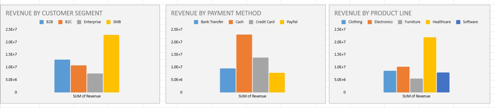
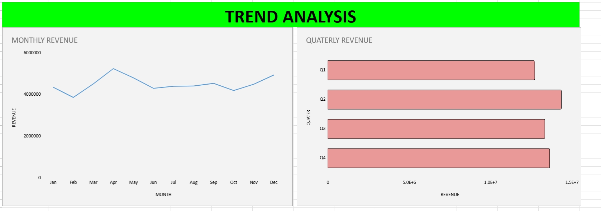
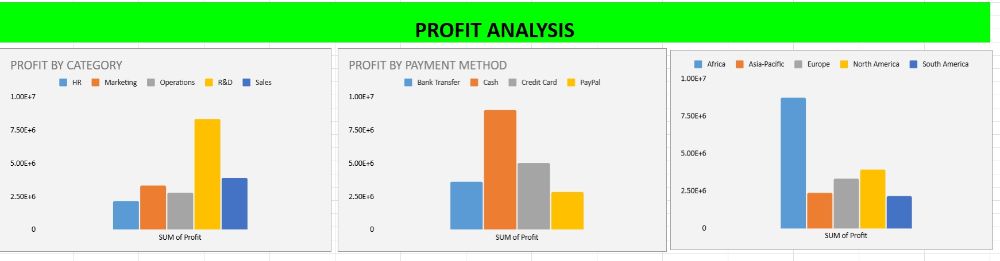

# Sales Performance Analysis Dashboard using Microsoft Excel

## Overview

This project showcases an end-to-end Sales Performance Analysis Dashboard developed in Microsoft Excel. The objective of this project is to transform raw sales data into meaningful business insights through data cleaning, exploratory data analysis (EDA), Pivot Tables, Pivot Charts, and dashboard development.

The dashboard provides a comprehensive view of business performance by analyzing revenue, profit, expenses, customer behavior, regional performance, sales trends, and key business metrics. It is designed to support data-driven decision-making through interactive visualizations and business-focused reporting.

---

## Project Workflow

* Business Requirement Understanding (BRD)
* Data Cleaning & Validation
* Feature Engineering
* Exploratory Data Analysis (EDA)
* Pivot Table Analysis
* Dashboard Development
* Business Insights & Recommendations

---

## Tools & Skills Used

* Microsoft Excel
* Pivot Tables
* Pivot Charts
* Data Cleaning
* Data Validation
* Conditional Formatting
* Dashboard Design
* KPI Development
* Business Analysis
* Data Visualization

---

## Dashboard Features

* Executive KPI Cards
* Revenue Analysis
* Profit Analysis
* Expense Analysis
* Revenue by Category
* Revenue by Region
* Department Performance Analysis
* Product Line Analysis
* Customer Segment Analysis
* Payment Method Analysis
* Monthly & Quarterly Sales Trends
* Correlation Analysis
* Interactive Dashboard

---

## Project Overview

 

 

 

 

---

## Key Performance Indicators

* Total Revenue
* Total Expenses
* Total Profit
* Profit Margin
* Total Transactions
* Average Discount

---

## Business Questions Addressed

* Which region generates the highest revenue?
* Which product category contributes the most to total revenue?
* Which department performs the best?
* Which customer segment generates the highest sales?
* Which payment method is used most frequently?
* How do revenue and profit change over time?
* What impact do discounts have on profitability?

---

## Key Insights

* Evaluated overall business performance using revenue, profit, and expense metrics.
* Compared regional and category-wise sales performance.
* Identified high-performing departments and product lines.
* Analyzed customer segment contribution.
* Examined payment method distribution.
* Studied monthly and quarterly sales trends.
* Performed correlation analysis to understand relationships between revenue, expenses, profit, and discounts.

---

## Learning Outcomes

This project helped strengthen practical skills in:

* Data Cleaning
* Exploratory Data Analysis (EDA)
* Business Analytics
* KPI Development
* Pivot Tables
* Pivot Charts
* Dashboard Design
* Data Visualization
* Business Reporting

---

## Conclusion

This project demonstrates how Microsoft Excel can be used to transform raw business data into meaningful insights through a structured analytics workflow. It reflects practical Excel skills commonly used in business intelligence, reporting, and data analytics projects.
